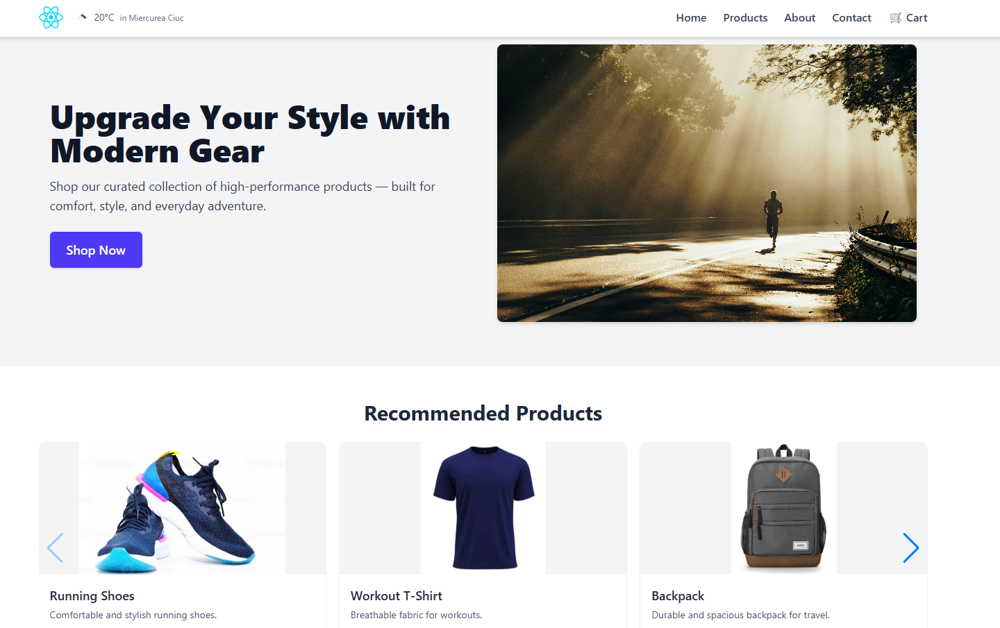

# React Mini Storefront

A modern e-commerce storefront built with **React.js**, **Vite**, and **Tailwind CSS**, featuring a mock product catalog, shopping cart with localStorage, responsive design, and real-time weather widget.

## Features

-  Built with React + Vite
-  Styled using Tailwind CSS
-  Add to Cart functionality with quantity controls
-  Cart persistence via `localStorage`
-  Product detail pages with dynamic routing
-  Product loading skeleton
-  Navigation with mobile responsiveness
-  Product recommendation carousel (mocked)
-  Weather & location widget (OpenWeatherMap API)
-  Newsletter form (frontend only)
-  Fully responsive design

## 📂 Folder Structure

src/
├── assets/ # Static images, logos
├── components/ # Reusable components (Navbar, Footer, ProductCard, etc.)
├── pages/ # Main pages (Home, ProductDetails, Cart)
├── context/ # CartContext with useReducer
├── data/ # Local product data (optional)
├── App.jsx # Main app layout
├── main.jsx # Entry point
public/
├── images/ # Product images
├── products.json # Mock product data

## Tech Stack

- React.js (Vite)
- Tailwind CSS
- React Router
- React Icons
- OpenWeatherMap API
- LocalStorage
- JSON for mock data

## Getting Started

1. **Clone the repo**

git clone https://github.com/yourusername/storefront.git
cd storefront

2. **Install dependencies**
npm install

3. **Start the dev server**
npm run dev

4. **Build for production**
npm run build

Environment Variables
To use the weather widget, add a .env file in the root:
VITE_OPENWEATHER_API_KEY=your_api_key_here (you can get one from https://openweathermap.org/)

